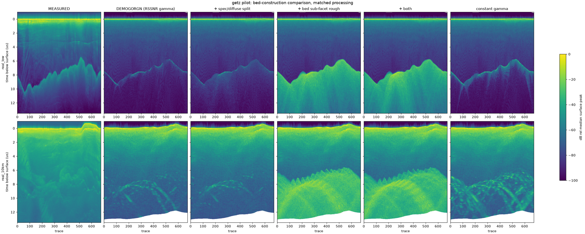
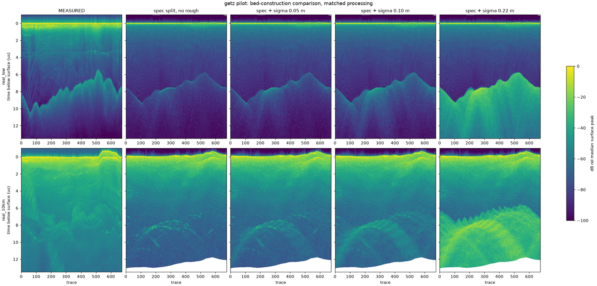
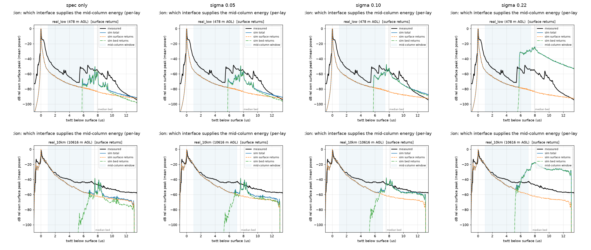

# Bed scattering physics: the adopted specular/diffuse + sub-facet roughness model

*Adopted 2026-08-21 from the getz pilot investigation; encoded in every
experiment spec (`reflectivity.specular_diffuse` + `physics.bed_roughness`).*

## The two symptoms

With the bed modeled as smooth coherent facet mirrors (the pre-2026-08-21
default), two fidelity failures appeared on the getz pilot at every bed
topography source (BedMachine, DEMOGORGN, radar picks):

1. **Spotted bed.** The simulated bed rendered as discrete glints — a
   facet only returns power when its normal happens to bisect the radar
   direction (sun-glitter selection) — where the measured product shows
   continuous horizons. A constant-reflectivity control run kept the
   spots, exonerating the RSSNR reflectivity painting.
2. **Post-bed falloff too slow.** Measured power drops at −8.9 dB/µs after
   the bed on the low pass; the simulation gave −2.6 to −5.5 depending on
   bed source, because glinting facets return at full normal-incidence
   strength at any angle — there is no angular backscatter law to dim the
   late, oblique arrivals.

## The fix: two components, one per symptom

Tested as a matrix on the DEMOGORGN bed (the statistical-bed baseline),
low + 10 km passes:

- **Tilt-gated specular/diffuse split** (`specular_fraction: 0.5,
  tilt_s0_deg: 3.0` — the T5 values that fit all three altitudes' tail
  shapes in the 2026-08 study): supplies the angular decay. It nearly
  closes the 10 km tail (−3.1 vs measured −2.9 dB/µs) and halves the
  below-bed energy there, but does not fix the spots.
- **Gerekos sub-facet bed roughness at σ = 0.10 m, l = λ_ice (0.886 m)**:
  broadens every facet's angular response, drawing a continuous horizon at
  both altitudes. The σ value matters: the historical T1 value σ = 0.22 m
  floods everything below the bed with an incoherent halo (its 2026-08
  rejection reproduced exactly); the incoherent channel scales as (kσ)²,
  and a sweep (0 / 0.05 / 0.10 / 0.22) shows σ = 0.10 is where the horizon
  is continuous while the below-bed energy stays physical.

## The evidence in the decomposition

At σ = 0.10 the simulated **bed-return mean profile lands on the measured
curve** through the bed peak and tail on the low pass — the statistical
bed-energy criterion read directly off the per-interface decomposition.
Single-trace bed-window margins stay physical (+25 dB low, +18 dB at
10 km) where σ = 0.22 gives absurd +45–56 dB.

| DEMOGORGN + | below-bed frac (low/10 km) | tail low (meas −8.9) | tail 10 km (meas −2.9) | horizon |
|---|---|---|---|---|
| smooth mirrors (old default) | 0.001 / 0.41 | −2.6 | −2.5 | thin line / spots |
| split only | 0.012 / 0.21 | −3.9 | −3.1 | spots remain |
| split + σ 0.05 | 0.023 / 0.26 | −4.5 | −3.5 | continuous, soft spots at 10 km |
| **split + σ 0.10 (adopted)** | 0.075 / 0.39 | −5.5 | −3.8 | **continuous both altitudes** |
| split + σ 0.22 (T1, rejected) | 0.27 / 0.57 | −5.0 | −2.8 | flooded |

## Known limitations

- Evidence is getz-only so far; the benchmark protocol exists to check the
  other lines (re-run `pilot_smoke` / `std_benchmark` per line).
- The remaining low-pass tail gap (−5.5 vs −8.9) is quantitatively
  consistent with unmigrated along-track diffraction: the sim processes at
  the alias-limited aperture of the product posting, while CSARP's full
  aperture migrates each relief bump's hyperbola back onto the bed. A
  posting sweep (div 2/4) confirmed the mechanism and its cost scaling;
  fixing it outright needs ~8–30× posting (cloud-scale) and is not
  adopted.
- The double-count guard raises the RSSNR-mapped reflectivity by the nadir
  coherent roughness attenuation so the nadir bed level is conserved;
  `sigma` here is SUB-FACET (sub-metre) roughness, unrelated to the
  bump-scale relief carried by the bed DEM.
- Related but separate: the picked-bed cross-track ridge artifact and its
  conditioned-field decorrelation live on the `h2-bed-crosstrack` branch
  (merge decision pending).

Chronology and per-run numbers: `claude_notes/gamma_solve_design_2026-08-20.md`
(calibration era) and the session outputs under `outputs/antarctica_getz/pilot_dgn*`.
