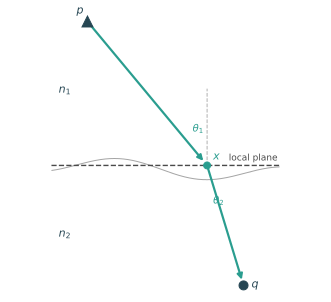
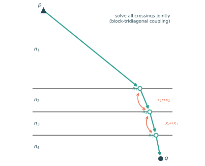

# Refraction geometry

Every subsurface return in `soundersim` travels a bent path: the ray from the platform to a buried facet refracts at each interface it crosses. [Multilayer simulation](multilayer_simulation.md) sketches this in one line ("the two-point Snell problem is solved per crossing"); this page explains the geometry, the approximation the current chained solver makes, and the joint solve that removes it.

## The problem

To simulate a facet buried under *N* interfaces we need the actual refracted ray path from the platform to the facet — its per-leg lengths and angles set the delay, the phase, the Fresnel transmission at every crossing, and the geometric spreading. The governing principle is Fermat's: the physical path is the one that makes the total optical path

```
T = Σ nᵢ · |segmentᵢ|
```

*stationary* with respect to where it crosses each interface. Setting the derivative to zero at every crossing is exactly Snell's law there — `nᵢ sin θᵢ = nᵢ₊₁ sin θᵢ₊₁` at each interface. Finding the path and enforcing Snell's law at every crossing are the same problem.

## The two-point solve

The building block (`soundersim.refraction.snell_crossing`) handles a **single** interface: a platform `p` in medium `n₁`, a target `q` in medium `n₂`, and the plane between them. It finds the crossing `x` where `n₁ sin θ₁ = n₂ sin θ₂` — equivalently, the minimum of `n₁·|p−x| + n₂·|x−q|` over the plane.



*The two-point solve at one interface. The objective is strictly convex, so the crossing lies in the vertical plane through `p` and `q`; the solve reduces to a 1-D Newton iteration on `sin θ` in the rarer medium (singularity-free at the critical angle) with a fixed iteration count, which keeps it JAX-compilable and exact to float precision. The true surface is wavy (thin grey); the solve uses that facet's flat **local plane** (dashed) — see [what stays approximate](#what-stays-approximate-either-way).*

This is exact for its plane and robust all the way to grazing incidence. It is validated against a brute-force Fermat referee (`soundersim.compare.fermat`) that minimizes the two-media optical path over the true surface by direct float64 grid search.

## The sequential-chain approximation

For a facet under several interfaces, the current multilayer kernel **chains** two-point solves top-down: solve platform → target against interface 1 (index pair `n₁,n₂`), step to that crossing, solve that crossing → target against interface 2 (`n₂,n₃`), and so on. Each solve is exact for its own plane — but each one treats *everything below its interface as a single medium*, i.e. it assumes the remaining path to the target is **straight**.

That assumption is wrong even for flat, parallel layers, because the remainder bends again at every interface below:


*True stationary path (teal, open crossings) vs. the sequential chain (orange, filled crossings) through three interfaces. At its first step the chain solves platform → target against interface 1 assuming the **dashed straight remainder** below — but the real path refracts again at interfaces 2 and 3, so the true first crossing sits elsewhere, and the discrepancy propagates. Index contrasts here are exaggerated (n = 1, 2, 3, 4) to make the deviation visible on the page; the crossings differ by ~1 m at this contrast.*

For flat parallel layers the true path has a single conserved **ray parameter** `p = nᵢ sin θᵢ`, constant across all layers (Diagram 2's teal path is computed from that closure). The chain does not conserve it, because each two-point solve sees only its own index pair.

The error is **second-order in layer contrast**: it vanishes as the index steps shrink, is identically zero for a single crossing (the surface + bed case) and for any number of zero-contrast crossings, and stays small for the firn case — many closely spaced, low-contrast layers — which is exactly where the chain is used in production. It becomes measurable on rough and high-contrast interfaces, where it was quantified against the Fermat referee (the `twomedia_field` report case and `tests/test_refraction.py`). Measured against the joint solve (`tests/test_refraction_joint.py`): on flat parallel air–firn–ice stacks the chain's crossings err by **43–120 m** and its optical path by **4.5–18.8 m** (N = 2/3, km-scale offsets), where the joint solution matches the analytic ray-parameter closure to ≤ 1.3×10⁻¹³ m.

There is also a cost problem. The chain unrolls into the compiled graph: *N* crossings, each with its own Newton loop, gives a graph that grows like *N*² and must be recompiled for each layer count. A firn stack of N = 80 explicit layers took **26.6 min to compile** ([firn investigation](../claude_notes/firn_investigation_findings.md)), which blocks the N ≈ 150–300 stacks needed to check convergence of the firn power plateau.

## The joint solve

The joint solve (`soundersim.refraction_joint.joint_crossings`) drops the straight-remainder assumption by solving **all N crossings at once**. The unknowns are the crossing offsets `x₁…x_N`; the objective is the full optical path `Σ nᵢ·|segmentᵢ|`; its stationarity gives Snell's law at every interface *simultaneously*. The converged path is the true stationary path of the whole stack.



*The joint picture: `x₁…x_N` are solved together. Each crossing shares a segment only with its immediate neighbours, so crossing `i` couples only to `i±1` (double arrows) — the stationarity system's Jacobian is **block-tridiagonal**.*

That tridiagonal structure is what makes it practical. One Newton step solves the block-tridiagonal system in **O(N)** via the Thomas algorithm (forward elimination + back-substitution), batched over all facets and traces. Written as a fixed-size scan, the whole step is **one compiled graph regardless of N** — O(1) in layer count, versus the chain's O(N²) unrolled graph and its per-layer recompile (measured: the solver jit-compiles in **0.29 s at N = 10 and at N = 80**). The sequential chain is the natural **initializer**: it gives a good starting path that the joint Newton refines to stationarity (with safeguarding near grazing / total-internal-reflection, where a path is invalid if *any* crossing goes evanescent).

The payoff is on the two axes the chain struggles with: accuracy on rough, high-contrast interfaces where chaining degrades, and flat compile cost for large-N firn stacks. One honest caveat the other way: per crossing, the fixed damped-Newton budget costs ~5–10× the chain's cheap 1-D iteration, so *cached* (already-compiled) deep runs are slower — the joint path wins on first call and on any workflow that changes layer counts, and it removes a physics approximation while doing so. Measured end-to-end on the firn-investigation scene (80 explicit layers, 3 traces): first call **319 s (5.3 min) joint vs 1593.5 s (26.6 min) sequential** — the joint sweep's total compile across N = 10…80 is ~5 s (power-of-two padding buckets shared across target layers) where the sequential path pays ~26 min of compile at N = 80 alone; cached repeat 319 s joint vs 31.2 s sequential; an N = 160 run — unreachable for the chain (compile alone projects to ~2 h) — completes its first call in **22 min** with the joint path (total compile ~6 s).

> **API.** The solver is `soundersim.refraction_joint.joint_crossings` (with `sequential_chain` as the drop-in chain reference on the same plane stacks, returning the same `JointCrossings` structure). The multilayer kernel selects the path via `SimConfig.refraction: "sequential" | "joint"` — default **joint** for targets under two or more interfaces; single-crossing targets always use the sequential two-point path, which is already exact there (the joint solver reproduces it to 2×10⁻¹¹ m). Kernel integration details (facet anchoring, no-op padding buckets, fixed budgets): `kernels/multilayer.py`; measured benchmarks: the `refraction_joint` report case.

## What stays approximate either way

Both solvers model each interface by its **local facet plane** — one flat plane per facet, not the true curved or faceted surface. The crossing is found on that plane and then re-anchored to the nearest facet's tangent plane. This local-plane approximation is an *anchoring* error, quadratic in the anchor offset and negligible when facets are small against the interface's roughness wavelength (measured in `tests/test_refraction.py`). The joint solve removes the *chaining* approximation but keeps the local-plane one; neither reproduces the true continuously-curved surface exactly.

The ground truth above both solvers is the Fermat referee (`compare/fermat.py`) evaluated on the **actual sampled surface** — it makes no plane approximation and no chaining assumption, so it bounds both error sources at once.

## Verification map

- **Analytic flat stacks.** Parallel layers have a single conserved ray parameter `nᵢ sin θᵢ`; crossings and optical path have closed forms to check against (the same `slab_absolute` closed form gates the full multilayer kernel). Measured: joint ≤ 1.3×10⁻¹³ m; chain 43–120 m crossing / 4.5–18.8 m optical path (N = 2/3).
- **Fermat referee.** `compare/fermat.py` (`fermat_crossing` two-point; `fermat_path` for N interfaces) minimizes the true multi-interface optical path over the sampled surface — the plane-and-chaining-free ground truth. Measured on tilted stacks: joint ≤ 9.1×10⁻¹³ m optical path vs. the chain's 0.94–1.96 m.
- **Reciprocity.** Up and down solves must return the same path (verified to ~10⁻¹² m).
- **Cross-solver regression.** Joint vs. sequential through the full kernel (`tests/test_multilayer_joint.py`): on **firn-like** stacks the two agree tightly (window-integrated field delta ~10⁻³ — the chain's second-order error is negligible there); on **high-contrast** stacks they measurably differ, and through the kernel's own facet anchoring the joint delays sit at the solver's residual floor against the Fermat referee (≤ 6.4×10⁻⁷ m) where the chain errs by ~0.4 m.
